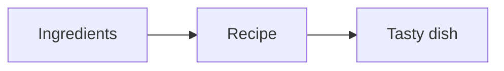
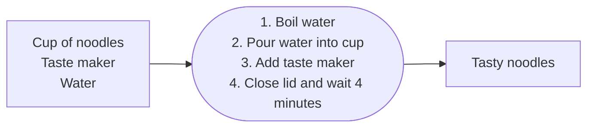
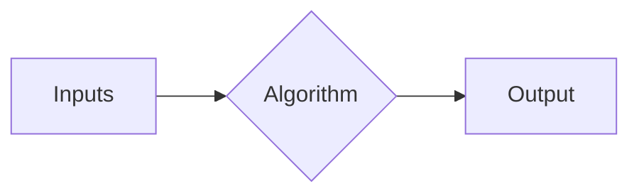
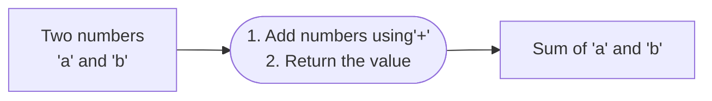

# Whats is an algorithm
__An algorithm is a set of well-defined instructions to solve a particular problem.__

## Programming
Algorithm to add two numbers

## Characteristics
- Well defined inputs and outputs
- Each step should be clear and unambiguous
- Language independent

## Why algorithms?
- As developer, you're going to come across problems that you need to solve
- Learning algorithms translates to learning different techniques to efficiently solve those problems
- One problem can be solved in many ways using algorithms
- Every algorithm comes with is own tradeoffs when it comes to performance 