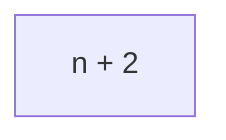
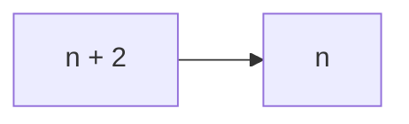

# Big-O Notation
The worst case copmplexity of an algorithm is represented using the Big-O notation

Big-O notation describes the complexity of an algorithm using algebraic terms

It has two important characteristics
- It is expressed in terms of the input
- It focuses on the bigger picture without  getting caught up in the minute details

## Big-O Time complexity

Define the sum of first ___N___ natural numbers
```javascript
function summation(n) {
    let sum = 0;
    for (let i = 0; i < n; i++) {
        sum += i;
    }
    return sum;
}
```

```
Example:
summation(4) = 10
1+2+3+4 = 10
```

We all already we know calculate the absolute running time of an algorithm and infer that cannot be the time complexity.

What we do instaed is count the number of times a statement executed based on the imput size.

```
Example:
n = 4
Line 2: Executed only once(1)
Line 4: Executed four times(4)
Line 6: Executed only once(1)
Total count: 4 + 2 (n + 2)
```

- It focuses on the bigger picture without  getting caught up in the minute details



n = 100 = 100+2

n = 1000 = 1000+2

n = 1000 = 1000+2

.

.

.

n = 100000000 = 100000000+2

At this point the +2 is very insignificant we can actually drop it.

<hr>

><u>__Time Complexity__</u>
>
>__O(n) - Linear__

At the size of input increases the time complexity also increases.
```javascript
function summation(n) {
    let sum = 0;
    for (let i = 0; i < n; i++) {
        sum += i;
    }
    return sum;
}
```
### Big-O Calculation
Sumation of first ___N___ 
natural number.

><u>__Time Complexity__</u>
>
>__O(1) - Constant__
```javascript
function summation(n) {
    return (n * (n + 1)) / 2;
}
```

### Big-O Calculation contd.
<u>__Time Complexity__</u>

>__O(n<sup>2</sup>) - Quadratic__
>
>3n<sup>2</sup> + 5n<sup>2</sup> + 1
```javascript
for ( i = 0; i < n; i++ ) {
    for ( j = 0; j < i; j++ ) {
        // Some code
    }
}
```

<u>__Time Complexity__</u>

>__O(n<sup>3</sup>) - Cubic__
>
>3n<sup>2</sup> + 5n<sup>2</sup> + 1
```javascript
for ( i = 0; i < n; i++ ) {
    for ( j = 0; j < i; j++ ) {
        for ( k = 0; k < j; k++ ) {
            // Some Code
        }
    }
}
```
<u>__Time Complexity__</u>

>__O(logn) - Logarithmic__
>
>Input size reduces by half every iteration

## Space complexity
_O(1) - Constant_

_O(n) - Linear_

_O(logn) - Logarithmic_

### Big O trend

_Big-O Complexity Chart_


## Few points to note
- Multiple algorithms exist for the same problem and there is no one right solution. Different algorithms work well under different constraints.
- The same algorithm with the same programming language can be implemented in different ways.
- When writing programs at work, don't lose sight of the big picture. Rather than writing clever code, write code that is simple to read and maintain.


