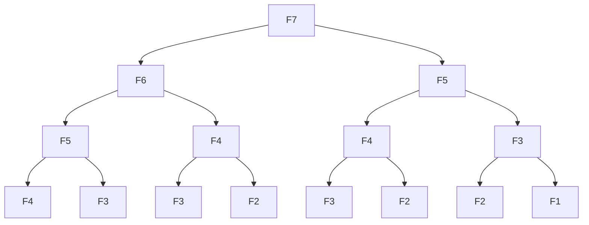

# Recursive Fibonacci sequence
<u>__Problem__</u> - Give a number ___"n"___, find the ___"nth"___ element of the Fibonacci sequence

In mathematics, the Fibonacci sequence is a sequence in which each number is the sum of the two preceding ones.

The first two numbers in the sequence are 0 and 1. (0, 1, 1, 2, 3, 5, 8 . . .)

>recursiveFibonacci(0) = 0
>
>recursiveFibonacci(1) = 1
>
>recursiveFibonacci(6) = 8

## Tips for recursive solutions
- Figure out how to break down the problem into smaller versions of the same problem

- Identify the base case for recursion

## Recursive Fibonacci sequence contd.
The Fibonacci sequence is a sequence in which each number is the sum of the two preceding ones.

If $F$ represents a function to calculate the Fibonacci number, then 

$F_n = F_(n-1) + F_(n-2)$

__Base case__

$F_0 = 0$ and $F_1 = 1$

$F_2=F_1 + F_0$

$F_2= 1 + 0$

$F_2 = 1$

## Recursive - time complexity
