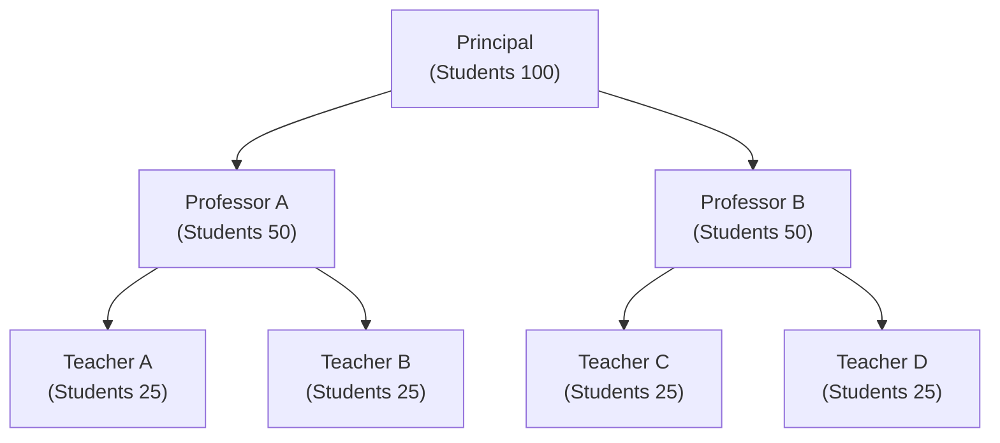

# Recursion
__<u>What?</u>__

Recursion is a problem solving technique where the solution depends on the solutions to smaller instances of the same problem

Recursion is when a function calls itself

__<u>Why?</u>__

A great technique to simplify your solution

If you find yourself breaking down your problem into smaller versions of the same problem, recursion is very useful

## Analogy
How many students in the collage - 
Principal Reply Total numbers of students is equal

## A few points about recursion
1. Every recursive solutions needs to have a base case - a condition to terminate the recursion.
2. Recursion might simplify solving a problem but it does not always translate to a faster soltuion. A recursive solution may be far worse compared to an iterative solution.
3. Recursion is a topic that is not the most straight forward to understand. Do not give up if you struggle with the concept.