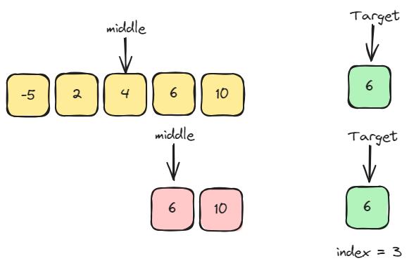

# Search algorithms
- Linear search
- Binary search
- Recursive binary search

## Linear Search
<u>__Problem__</u> - Given an array of ___"n"___ elements and a target element ___"t"___, find the index of ___"t"___ in the array.  Return ___"-1"___ if the target element is not found.

<u>__Ex.__</u>

___"arr"___ = [-5, 2, 10, 4, 6], ___"t"___ = 10 => Should return ___"2"___

___"arr"___ = [-5, 2, 10, 4, 6], ___"t"___ = 6 => Should return ___"4"___

___"arr"___ = [-5, 2, 10, 4, 6], ___"t"___ = 20 => Should return ___"-1"___

### Linear search pseudocode
1. Start at the first element in the array and move towards last.

2. At each element though, check if the element is equal to the target element.

3. If element found, return the index of the element

4. If element not found, return -1

## Binary search
<u>__Problem__</u> - Given a __sorted__ array of ___"n"___ elements and a target element ___"t"___, find the index of ___"t"___ in the array. Return ___"-1"___ if the target element is not found

<u>__Ex.__</u>

___"arr"___ = [-5, 2, 4, 6, 10], ___"t"___ = 10 => Should return ___"4"___

___"arr"___ = [-5, 2, 4, 6, 10], ___"t"___ = 6 => Should return ___"3"___

___"arr"___ = [-5, 2, 4, 6, 10], ___"t"___ = 20 => Should return ___"-1"___

### Binary search pseudocode
1. If the array is empty, return -1 as the elment cannot be found.

2. If the array has elements, find the middle element in the array. If target is equal to the middle element, return the middle element index.

3. If target is less than the middle element, binary search left half of the array

4. If target is greater than the middle element, binary search right half of the array

## Recursive binary search
### Recursive Binary search pseudocode
1. If the array is empty, return -1 as the elment cannot be found.

2. If the array has elements, find the middle element in the array. If target is equal to the middle element, return the middle element index.

3. If target is less than the middle element, binary search left half of the array

4. If target is greater than the middle element, binary search right half of the array