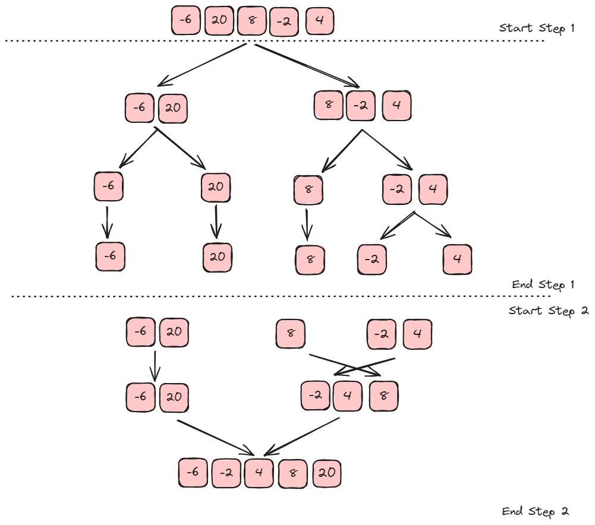

# Sorting Algorithms
- Bubble Sort
- Insertion Sort
- Quick Sort
- Marge Sort

## Bubble Sort
<u>__Problem__</u> - Given an array of integers, sort the array.
```javascript
const array = [-6, 20, 8, -2, 4]
bubbleSort(arr) // => [-6, -2, 4, 8, 20]
```

### Bubble Sort Idea
1. Compare adjacent elements in the array and swap the positions if they are not in the intended order.

2. Repeat the instruction as you step through each element in the array.

3. Once you step through the whole array with no swaps, the array is sorted.

```javascript
[-6 20 8 -2 4]
[-6 "20" "8" -2 4] => [-6 "8" "20" -2 4] // Swap since 20 > 8
[-6 8 "20" "-2" 4] => [-6 8 "-2" "20" 4] // Swap since 20 > -2
[-6 8 -2 "20" "4"] => [-6 8 -2 "4" "20"] // Swap since 20 > 4
// End of array. Elements Swaped? Yes ? Repeat the comparison.
["-6" "8" -2 4 20]
[-6 "8" "-2" 4 20] => [-6 "-2" "8" 4 20] // Swap since 8 > -2
[-6 -2 "8" "4" 20] => [-6 -2 "4" "8" 20] // Swap since 8 > 4
[-6 -2 4 "8" "20"]
// End of array. Elements Swaped? Yes ? Repeat the comparison.
["-6" "-2" 4 8 20]
[-6 "-2" "4" 8 20]
[-6 -2 "4" "8" 20]
[-6 -2 4 "8" "20"]
// End of array. Elements Swaped? No ? Array is sorted.

function bubbleSort(arr){
    let swapped;
    do {
        swapped = false;
        for(let i = 0; i < arr.length - 1; i++) {
            if (arr[i] > arr[i+1]) {
                let temp = arr[i];

                arr[i] = arr[i+1];
                arr[i+1] = temp;
                swapped = true;
            }
        }
    } while(swapped)
}

const arr = [8,20,-2,4,-6]
bubbleSort(arr);

console.log(arr) // [-6, -2, 4, 8, 20]

// Time Complexity = O(n^2) - Quadratic
```

## Insertion Sort
<u>__Problem__</u> - Given an array of integers, sort the array.
```javascript
const array = [-6, 20, 8, -2, 4]
insertionSort(arr) // => [-6, -2, 4, 8, 20]
```

### Insertion Sort Idea
1. Virtually split the array into a sorted and an unsorted part.
2. Assume that the first element is already sorted and remaining elements are unsorted.
3. Select an unsorted element and compare with all elements in the sorted part.
4. If the elements in the sorted part is smaller than the selected element, proceed to the next element in the unsorted part. Else, shift larger elements in the sorted part towards the right.
5. Insert the selected element at the right index.
6. Repeat till all the unsorted elements are placed in the right order.

```javascript
[ -6, "20", "8", "-2", "4" ]  |  NTI = 20  |  SE = -6  |  // -6 > 20 ? No. Place 20 to the right of -6.

[ -6, 20, "8", "-2", "4" ]    |  NTI = 8   |  SE = 20  |  // 20 > 8 ? Yes. Shift 20 to the right.

[ -6, 20, 20, "-2", "4" ]     |  NTI = 8   |  SE = -6  |  // -6 > 8 ? No. Place 8 to the right of -6.

[ -6, 8, 20, "-2", "4" ]      |  NTI = -2  |  SE = 20  |  // 20 > -2 ? Yes. Shift 20 to the right.

[ -6, 8, 20, 20, "4" ]        |  NTI = -2  |  SE = 8   |  // 8 > -2 ? Yes. Shift 8 to the right.

[ -6, 8, 8, 20, "4" ]         |  NTI = -2  |  SE = -6  |  // -6 > -2 ? No. Shift -2 to the right of -6

[ -6, -2, 8, 20, "4" ]        |  NTI = 4   |  SE = 20  |  // 20 > 4 ? Yes. Shift 20 to the right

[ -6, -2, 8, 20, 20 ]         |  NTI = 4   |  SE = 8  |  // 8 > 4 ? Yes. Shift 8 to the right

[ -6, -2, 4, 8, 20 ]          |  NTI = 4   |  SE = -2  |  // -2 > 4 ? No. Shift 4 to the right of  -2


/*
    NTI = NumberToInsert
    SE = SortedElement
    Time Complexity = O(n^2) - Quadratic
*/


function insertionSort(arr) {
    for(let i = 1; i < arr.length; i++) {
        let numberToInsert = arr[i];
        let numberToCompare = i - 1;

        while(numberToCompare >= 0 && arr[numberToCompare] > numberToInsert) {
            arr[numberToCompare + 1] = arr[numberToCompare]
            numberToCompare = numberToCompare - 1;
        }

        arr[numberToCompare + 1] = numberToInsert;
    }
}

const arr = [8, 20, -2, 4, -6]
insertionSort(arr) // [-6, -2, 4, 8, 20]
console.log(arr)
```

## Quick Sort
<u>__Problem__</u> - Given an array of integers, sort the array.
```javascript
const array = [-6, 20, 8, -2, 4]
quickSort(arr) // => [-6, -2, 4, 8, 20]
```

### Quick Sort Idea
1. Identify the pivot element in the array.
    - Pick first element as pivot.
    - Pick last element as pivot (Our Approach).
    - Pick a random element as pivot.
    - Pick median as pivot.
2. Put everything that's smaller than the pivot into a ___"left"___ array and everything that's greater than the pivot into a ___"right"___ array.
3. Repeat the process for the individual ___"left"___ and ___"right"___ arrays till you have an array of length 1 which is sorted by definition.
4. Repeatedly concatenate the left array, pivot, and right array till one sorted array remains.

```javascript
                        [-6, 20, 8, -2, 4]

        LEFT1                  PIVOT1             RIGHT1
        [-6, -2]               [4]                [8, 20]

LEFT2   PIVOT2  RIGHT2                      LEFT3   PIVOT3  RIGHT3 
[-6]    [-2]    []                          [8]     [20]    []

[LEFT2 => PIVOT2]       =>    [PIVOT1]  =>  [LEFT3 => PIVOT3]


function quickSort(arr) {
    if (arr.length < 2) {
        return arr;
    }
    let pivot = arr[arr.length - 1];
    let left = [];
    let right = [];

    for(let i = 0; i < arr.length - 1; i++) {
        if (arr[i] < pivot) {
            left.push(arr[i]);
        } else {
            right.push(arr[i]);
        }
    }

    return [...quickSort(left), pivot, ...quickSort(right)]
};
const arr = [8, 20, -2, 4, -6];
console.log(arr);
console.log(quickSort(arr)); // [ -6, -2, 4, 8, 20 ]

// Time complexity = Worst case - O(n^2);
// Time complexity = Average - O(nlogn);
```

## Merge Sort
<u>__Problem__</u> - Given an array of integers, sort the array.
```javascript
const array = [-6, 20, 8, -2, 4]
mergeSort(arr) // => [-6, -2, 4, 8, 20]
```

### Merge Sort Idea
1. Divide the array into sub arrays, each containing only one element ( An array with one element is considered sorted )
2. Repeatedly merge the sub arrays to produce new sorted sub arrays until there is only one sub array remaining. That will be the sorted array.


```javascript
[-6] [20]             => []             // Left & Right are not empty. -6 < 20
[]   [20]             => [-6]           // Left is empty. Push right away.
[]   []               => [-6, 20] 

[8] [-2, 4]           => []             // Left & Right are not empty. -2 < 8.
[8] [4]               => [-2]           // Left & Right are not empty. 4 < 8.
[8] []                => [-6, 4]        // Right is empty. Push left away.
[]  []                => [-6, 4, 8]   


[-6, 20] [-2, 4, 8]   => []             // Left & Right are not empty -6 < -2.
[20] [-2, 4, 8]       => [-6]           // Left & Right are not empty -2 < 20. 
[20] [4, 8]           => [-6, -2]       // Left & Right are not empty 20 < 4.
[20] [8]              => [-6, -2, 4]    // Left & Right are not empty 20 < 8.
[20] []               => [-6, -2, 4, 8] // Right is empty. Push left away
[] []                 => [-6, -2, 4, 8, 20] 
```
